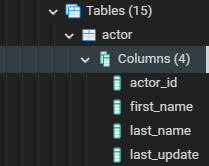
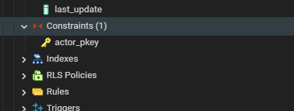
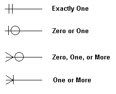

# Table columns and relationships

In pg admin we can see the names of the collumns that are available inside of a table, by expanding a table, and clicking on the collum, section

We can also see **constraints** such as **primary keys and foreign keys** 

**Indexes** and **triggers** and rules also

## Generate ERD

ERD stands for
> **Entity**
> **Relationship**
> **Diagram**

Rightclicking on a database and selecting this option, pgadmin will generate a large diagram that shows all tables, collumns and relationships between them

We can click the eye, or the short cut (Ctrl + Alt + T) to show fewer/more **details**

Alt + shift + F, **Zoom** **to** **fit** or clicking the disconnected square

### **Crow's foot notation**

